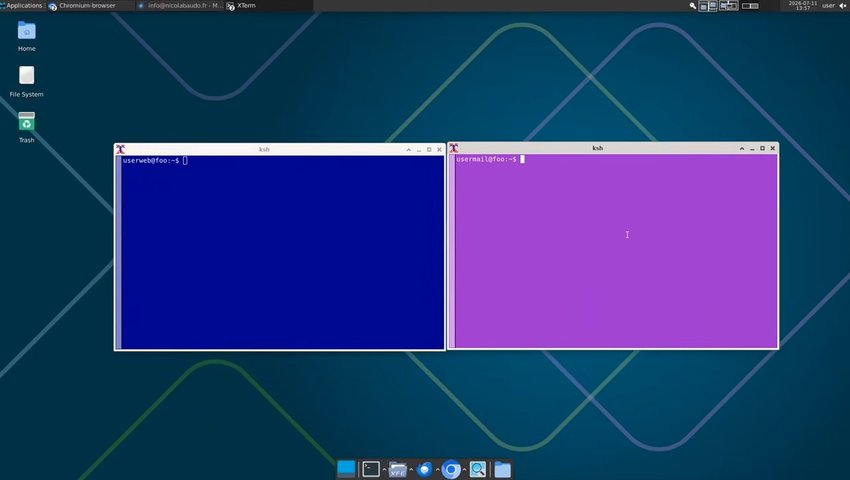

# dropQbsd

```
 __  +---+  __
   \_| Q |_/
     +---+
   dropQbsd
```

**Compartmentalization without virtualization — on the BSD family.**

Qubes-style domain isolation using native Unix users, `pf`, and `ksh`. Web, mail, and
documents run as separate users with no shared access except a policed drop zone.
No hypervisor, no VM images, no daemon.

~2,500 lines of `ksh` + 9 lines of C — small enough to audit in an afternoon.

Runs on 1 GB of RAM. Installs in ~30 minutes. Rebuilds faster — no databases,
no daemon state to restore. Zero lock-in.

[](...)
[](...)
[](...)
[](...)
[](...)
[](...)
[](...)

---

**Status:** beta. Used daily on real hardware. Expect sharp edges.

**Platforms:** OpenBSD (reference), FreeBSD (in testing), NetBSD (roadmap).

---

## Demo

[](https://gnulinux.tube/w/aymeWDMEZMbk2YQMqnMm93)

Three commands. Three habits. About thirty minutes. Done.


---

## 1. What is this?

Take the core insight of Qubes OS — security through compartmentalization — and
strip away the hypervisor. **dropQbsd** uses native BSD user separation instead
of heavy virtualization.

Each domain — web, mail, documents — runs as a dedicated user. They share
nothing except a single policed exchange directory. A handful of `ksh` scripts,
a declarative firewall policy, and standard Unix permissions do the rest.

No multi-gigabyte VM images. No Xen. No moving parts you can't audit in an
afternoon.

---

## 2. What dropQbsd does NOT protect against

Read this before the architecture. If your threat model requires any of the
following, dropQbsd is not the right tool today — **Qubes OS is.**

- **X11 input isolation.** X11 shares a single cookie (MIT-MAGIC-COOKIE-1)
  across all clients on a display. A compromised domain can keylog other
  domains, capture screenshots, and read the clipboard. This is a fundamental
  X11 limitation, not a dropQbsd bug. Mitigations in place — disposable
  sessions, per-session cookies via `xenodm`, XTEST disabled where possible —
  reduce the exposure window. They do not close it. **The paired
  desktop/server configuration (roadmap) resolves this.**
- **Conductor compromise.** `user` can launch apps in any domain via `run_app`.
  If `user` is compromised, all domains are compromised. Keep `user` minimal:
  no untrusted binaries, inspect files before importing.
- **Kernel-level attacks.** All domains share one kernel. A kernel exploit in
  one domain compromises everything. This is the tradeoff for avoiding
  virtualization.
- **Application-level telemetry.** BSD ships with zero telemetry, but
  applications you install may phone home independently. Use `librewolf`,
  `ungoogled-chromium`, or `qutebrowser`.

dropQbsd targets the most common real-world failures — malware, phishing,
cross-domain data leaks, silent policy violations. It does not target kernel
exploits or state-level adversaries. Those require virtualization or hardware
isolation.

---

## 3 Install

dropQbsd currently requires a manual installation on a fresh OpenBSD (or
FreeBSD) system. The process takes roughly 30 minutes and is documented step
by step in [INSTALL.md](./INSTALL.md).

An install script is on the roadmap — it is the single biggest barrier to
adoption today, and the next development priority.


## 4. Architecture

### 4.1 The Four Domains

| User     | Role                                                   | Network                         |
| -------- | ------------------------------------------------------ | ------------------------------- |
| user     | Conductor — orchestrates, imports/exports, administers | None (no direct network access) |
| userweb  | Web browser — isolated from mail and LAN               | HTTP/HTTPS only                 |
| usermail | Email client — isolated from web                       | Mail servers only               |
| userdoc  | Documents, sync, LAN storage — no direct internet      | LAN + Syncthing                 |

All belong to the `drop` group. Home directories are `chmod 700` — no
cross-domain snooping.

### 4.2 The Drop Zone (`/home/drop`)

The **only bridge** between domains. A shared directory with strict rules:

- `/home/drop` is `2770 root:drop` — SGID forces the `drop` group on all files,
  making quarantine a rare safety net rather than a daily occurrence
- Files in transit: `440` (read-only for owner and group)
- Directories in transit: `570` (group can traverse)
- Export directories: SGID `2770`, owned by `root:drop`

No domain can modify files once placed (enforced by 440 permissions). Cleanup
is handled by `enforce_drop` on its regular cycle. A cron job (`enforce_drop`)
runs every 60 seconds, correcting permissions, quarantining violations, and
cleaning abandoned artifacts.

**Import workflow:**

1. `qmv` moves a file into `/home/drop` via an atomic staging directory.
   Permissions are locked before the file is visible to other domains.
2. `qcp` copies a file into `/home/drop` without deleting the original.
3. `qimport` copies the file out into `~/Downloads`.
4. `enforce_drop` removes abandoned files after 30 minutes. No sentinels, no
   domain write access to the drop zone — cleanup is purely time-based.

### 4.3 The Conductor — `run_app` Architecture

`user` launches graphical apps inside any domain without switching users. The
mechanism is a three-file split designed to eliminate the attack surface of
privilege escalation:

| File                    | Type                          | Role                                                       |
| ----------------------- | ----------------------------- | ---------------------------------------------------------- |
| bin/run_app             | Compiled binary (setuid root) | Immutable gate — 9 lines of C, no logic, no attack surface |
| libexec/run_app_impl    | ksh script                    | All the logic — maintainable without recompilation         |
| src/run_app_wrapper.c   | C source                      | Kept for reference; only needed if OpenBSD ABI breaks      |

**How it works:**

1. `user` invokes `run_app` — the **only** file `user` ever touches directly
2. `run_app` calls `setuid(0)`, escalates to root, then `execv` transforms into
   `run_app_impl` passing all arguments through
3. `run_app_impl` (now running as root) locates the X11 cookie from xenodm's
   auth directory, creates an isolated runtime directory (or tmpfs in
   disposable mode), sets `HOME`, `DISPLAY`, `XAUTHORITY`, `XDG_RUNTIME_DIR`,
   and launches the application via `su -l`

The binary is the **blind gate**: it can do exactly one thing — call
`run_app_impl`. No parsing, no branching, no logic. Immutable after compilation.
If you need to add a domain, change paths, or tweak cleanup behavior, you edit
`run_app_impl` — a plain `ksh` script. No recompilation. The attack surface
stays frozen at 9 lines of C.

**`doas.conf` is minimal** — only `permit nopass root`. `user` has no `doas`
access at all. The compartmentalization is sealed: `user` cannot escalate to
root through any path except the blind gate, and the blind gate can only launch
domain applications.

**Disposable mode** mounts a tmpfs in RAM for the app's home directory. When
the app exits, the tmpfs is unmounted and everything is destroyed. Nothing
survives. Ideal for browsers and untrusted files.

```
$ /opt/dropQbsd/bin/run_app --disposable userweb qutebrowser --temp-basedir
$ /opt/dropQbsd/bin/run_app --disposable 1G userweb ungoogled-chromium https://example.com
```

Downloads made in disposable mode are bridged to the real
`/home/$USER/Downloads` via symlink — files survive browser exit.

### 4.4 Network Isolation

A **declarative policy** enforces strict per-domain rules. Two files describe
your security posture:

- `domains.conf` — the portable policy (identical on every install)
- `local.conf` — your local configuration (subnet, mail, services)

`gen_firewall` translates this policy into `pf.conf` for the target OS. The
policy describes **intent**; the backend handles **syntax**.

- **Default deny** — nothing gets out unless explicitly allowed
- `userweb` reaches ports 80/443 only, blocked from LAN and localhost
- `usermail` reaches only IPs in the `<mailserver>` table, only on mail ports
- `userdoc` reaches LAN subnets and Syncthing ports only
- Root has no permanent network access — only IPs in the `<updates>` table,
  populated on-demand

Service IPs and mail server IPs are managed dynamically via firewall tables,
populated from `local.conf`. No provider IPs are exposed in the public
repository.

OpenBSD and FreeBSD both use `pf`. NetBSD uses `npf`, which does not filter by
user — it is on the roadmap, not yet supported.

### 4.5 Domain Indicators

dropQbsd includes two scripts that show which domain the active window belongs
to, so you never lose track of what compartment you're working in.

| Script           | For                    | How it works                       |
| ---------------- | ---------------------- | ---------------------------------- |
| indicator_xfce4  | XFCE, MATE, any DE     | OSD popup overlay on domain change |
| indicator_cwm    | cwm, i3, dwm, spectrwm | Sets root window name via xsetroot |

Both indicators are launched automatically by `~/.xsession` — but only for the
conductor (`user`), whose desktop hosts windows from all domains via `run_app`.
Domain users (`userdoc`, `usermail`, `userweb`) don't need an indicator since
their sessions only ever contain their own windows. No manual configuration
required.

**indicator_xfce4** shows a large popup overlay centered on the active window
whenever you switch domains. Requires `dzen2` and `xdotool`:

```
doas pkg_add dzen2 xdotool
```

**indicator_cwm** sets the X11 root window name. cwm, i3, and dwm display it
automatically in their status bar — no extra configuration needed. Zero
dependencies beyond base X11.

**Detection:** the indicator checks the active window's title first (so xterms
with `-title 'userweb'` are always detected correctly), then falls back to
`_NET_WM_PID` and process owner, and finally matches `WM_CLASS` for apps like
xfe that don't expose their PID.

**Color mapping (consistent across all dropQbsd themes):**

| Domain           | Color         | Hex     |
| ---------------- | ------------- | ------- |
| userweb          | Bright blue   | #3399FF |
| usermail         | Bright orchid | #BB66EE |
| userdoc          | Bright green  | #33CC33 |
| user (conductor) | White         | #FFFFFF |
| root             | Bright red    | #FF3333 |

### 4.6 Archival Pipeline

```
usermail → export_mail_to_drop → usermail_export → pull_mail_from_drop → userdoc (1 backup)
userweb  → export_www_to_drop  → userweb_export  → pull_www_from_drop  → userdoc (3 backups)
```

Export files are `root:drop 440` — no domain user can modify them. Integrity
verified at each step.

### 4.7 What You Get

- **Compartmentalization without virtualization.** Qubes-style domain
  isolation, zero overhead.
- **Blind-gate privilege escalation.** `run_app` is a 9-line setuid binary that
  can only call `run_app_impl`. Logic stays in auditable `ksh`. Attack surface
  is frozen.
- **Disposable browsers.** tmpfs-backed, nothing survives exit. No persistent
  profiles. Downloads survive via symlink bridge.
- **Automated archival.** Email and websites compressed, verified, pulled across
  domains on schedule.
- **Quarantine with audit trail.** Files with incorrect group ownership are
  isolated with an explanation ticket.
- **Root web access on-demand.** `ensure_updates_table` populates the firewall
  table, `pkg_add_via_pf` and `syspatch_via_pf` do their job. No telemetry. No
  background phoning home.
- **Reinstallable in 30 minutes.** No databases, no daemons, no state you can't
  reconstruct from scripts and `/etc`.
- **Integrity verification.** Critical scripts are checksummed and verified via
  `signify(1)` on a cron schedule. All dropQbsd components log to `/var/log/`.
- **Dynamic firewall tables.** Mail server and service IPs are managed via
  `local.conf` — no provider details in the repository.

### 4.8 Optional Components

dropQbsd is fully functional with just the base system. Optional components for
a smoother experience — see INSTALL.md:

- **Syncthing** — LAN file synchronization for the document domain
- **Site Menu + pass** — password manager integration with one-click launching
- **Integrity verification** — cryptographic checksums via `signify(1)`
- **Color schemes** — coordinated skins for Midnight Commander, Xfe, and
  related editors per domain

---

## 5. Daily Usage

### 5.1 Moving Files Between Domains

Files move through `/home/drop`, the only bridge between domains. Three
commands handle all transfers, plus `file_bridge` for interactive use.

**Copy a file into the drop zone (original stays in place):**

```
$ /opt/dropQbsd/bin/qcp ~/document.pdf
```

**Move a file into the drop zone (original is deleted):**

```
$ /opt/dropQbsd/bin/qmv ~/document.pdf
```

While plain `cp` and `mv` also work (the drop zone's SGID ensures correct group
ownership), `qcp` and `qmv` are preferred. They apply correct permissions
immediately, reset file timestamps to prevent premature cleanup, verify the copy
succeeded, and stage files atomically.

**Import from the drop zone into ~/Downloads:**

```
# Absolute path
$ /opt/dropQbsd/bin/qimport /home/drop/document.pdf

# Relative path (auto-resolved inside /home/drop)
$ /opt/dropQbsd/bin/qimport document.pdf
$ /opt/dropQbsd/bin/qimport folder1

# Custom destination
$ /opt/dropQbsd/bin/qimport document.pdf ~/Documents
```

**Interactive transfer via file_bridge:**

```
$ /opt/dropQbsd/bin/file_bridge
```

Inside `nnn`, press `Space` to select files, then `;c` to copy, `;m` to move,
or `;i` to import. All four domains are visible simultaneously.

### 5.2 Launching Apps in Domains (as `user`)

**Disposable browser (tmpfs-backed, nothing survives):**

```
$ /opt/dropQbsd/bin/run_app --disposable userweb /usr/local/bin/qutebrowser --temp-basedir
```

**Browser flags for temporary profiles:**

- Chromium / Ungoogled-chromium: `--temp-profile`
- Firefox: `--private-window`
- Librewolf: `--temp-profile --private-window`
- Qutebrowser: `--temp-basedir`

Disposable mode already destroys everything on exit — these flags add an extra
layer by preventing the browser from writing to disk at all during the session.

**Disposable browser with custom tmpfs size:**

```
$ /opt/dropQbsd/bin/run_app --disposable 1G userweb /usr/local/bin/qutebrowser --temp-basedir
```

**Mail client in its isolated domain:**

```
$ /opt/dropQbsd/bin/run_app usermail /usr/local/bin/claws-mail
```

**File manager for documents:**

```
$ /opt/dropQbsd/bin/run_app userdoc /usr/local/bin/xfe /home/userdoc
```

Aliases for common commands are provided in `/etc/kshrc`:

```
# Global (all users):
alias qcp='/opt/dropQbsd/bin/qcp'
alias qmv='/opt/dropQbsd/bin/qmv'
alias qimport='/opt/dropQbsd/bin/qimport'

# Conductor only (user):
alias run='/opt/dropQbsd/bin/run_app'
alias runweb='/opt/dropQbsd/bin/run_app --disposable userweb /usr/local/bin/qutebrowser --temp-basedir'
alias runmail='/opt/dropQbsd/bin/run_app usermail /usr/local/bin/claws-mail'
alias rundoc='/opt/dropQbsd/bin/run_app userdoc /usr/local/bin/xfe /home/userdoc'
```

Note: no `doas` prefix — `run_app` is setuid root, so `user` invokes it
directly.

**Terminal in a domain (color-coded):**

```
$ /opt/dropQbsd/bin/xterm_user
$ /opt/dropQbsd/bin/xterm_userdoc
$ /opt/dropQbsd/bin/xterm_usermail
$ /opt/dropQbsd/bin/xterm_userweb
$ /opt/dropQbsd/bin/xterm_root
```

### 5.3 File Bridge

`file_bridge` opens a tmux session with four quadrants: `control_panel`
(top-left), and `nnn` instances for `userdoc`, `usermail`, `userweb`. The tmux
status bar and active pane border change color to match the active domain.

```
$ /opt/dropQbsd/bin/file_bridge
```

**Keys:**

| Key           | Action                                            |
| ------------- | ------------------------------------------------- |
| Alt+1         | Jump to control_panel                             |
| Alt+2         | Jump to userdoc                                   |
| Alt+3         | Jump to usermail                                  |
| Alt+4         | Jump to userweb                                   |
| Ctrl+b arrows | Navigate between quadrants (fallback)             |
| Space         | Select file(s) in nnn                             |
| ;c            | Copy selected files to /home/drop via qcp         |
| ;m            | Move selected files to /home/drop via qmv         |
| ;i            | Import selected files from /home/drop via qimport |
| .             | Toggle hidden files in nnn                        |
| Alt+k         | Quit                                              |

On exit, `file_bridge` automatically kills any orphaned `nnn` processes across
all domains.

### 5.4 Control Panel

`control_panel` is an ncurses dashboard that shows compartment status, drop
zone contents, and system health at a glance.

```
$ control_panel
```

**What you see:**

- **Domains** — which compartments are active and what process is running in each
- **Drop zone** — files awaiting import, permissions, age, quarantine status
- **System** — PF firewall state, enforcement logs, integrity verification,
  tmpfs usage (root authentication required)

**Keys:**

| Key | Action                                                 |
| --- | ------------------------------------------------------ |
| q   | Quit                                                   |
| a   | Authenticate as root (shows PF state, logs, integrity) |
| r   | Refresh root snapshot (when already authenticated)     |

The panel auto-refreshes every 15 seconds. Requires
`/opt/dropQbsd/libexec/root_snapshot` on the system.

### 5.5 System Updates

All update commands are run as root. Root has no permanent network access — the
`<updates>` PF table is populated on demand by each script.

**Full update (patches + firmware + packages + orphan cleanup):**

```
# /opt/dropQbsd/admin/update_openbsd_via_pf
```

**Security patches only:**

```
# /opt/dropQbsd/admin/syspatch_via_pf
```

**Install a specific package:**

```
# /opt/dropQbsd/admin/pkg_add_via_pf firefox
```

**Major release upgrade:**

```
# /opt/dropQbsd/admin/sysupgrade_via_pf
```

### 5.6 Monitoring

**Check quarantine:**

```
$ ls -la /home/drop/_quarantine/
$ cat /home/drop/_quarantine/*.txt
```

**Logs:**

```
$ tail /var/log/dropQbsd_drop.log        # Drop zone enforcement
$ tail /var/log/dropQbsd_sync.log        # Sync directory enforcement
$ tail /var/log/dropQbsd_integrity.log   # Script integrity verification
$ tail /var/log/dropQbsd_updates.log     # System update operations
```

**Live PF traffic:**

```
# tcpdump -n -e -ttt -i pflog0
```

**Integrity verification:**

```
# /opt/dropQbsd/libexec/verify_integrity
```

---

## 6. Scripts Reference

### 6.1 Core Workflow

| Script              | Run by                | Purpose                                                                                                                                                    |
| ------------------- | --------------------- | ---------------------------------------------------------------------------------------------------------------------------------------------------------- |
| file_bridge         | user (conductor only) | Launch 4-quadrant tmux file manager bridge across all domains. Includes control_panel in the top-left quadrant. Cleans up orphaned nnn processes on exit. |
| qimport             | Any user              | Copy from drop zone to ~/Downloads                                                                                                                        |
| qmv                 | Any user              | Move file/directory into /home/drop via atomic staging, set group and permissions                                                                          |
| qcp                 | Any user              | Copy file/directory into /home/drop without deleting the original                                                                                          |
| run_app             | user (setuid root)    | Blind-gate binary. Escalates to root, execs run_app_impl. The only privileged entry point user can touch.                                                |
| run_app_impl        | root (via run_app)    | ksh script with all launch logic — X11 cookie, runtime dir, tmpfs, su -l. Editable without recompilation.                                                  |
| run_app_wrapper.c   | — (source only)       | 9-line C source. Kept for reference; only needed if OpenBSD ABI breaks.                                                                                    |

### 6.2 Launchers and Utilities

| Script           | Run by                | Purpose                                                              |
| ---------------- | --------------------- | -------------------------------------------------------------------- |
| control_panel    | user (conductor only) | ncurses dashboard — domain status, drop zone contents, system health |
| indicator_cwm    | user (conductor only) | Domain indicator for cwm/i3/dwm via xsetroot                         |
| indicator_xfce4  | user (conductor only) | Domain indicator for XFCE/DEs via OSD popup                          |
| site_menu        | user (conductor only) | Two-phase site launcher with pass(1) integration                     |
| xterm_root       | root                  | Color-coded xterm for root (dark red)                                |
| xterm_user       | user (conductor only) | Color-coded xterm for the conductor domain (black)                   |
| xterm_userdoc    | user (conductor only) | Color-coded xterm for userdoc domain (dark green)                    |
| xterm_usermail   | user (conductor only) | Color-coded xterm for usermail domain (dark orchid)                  |
| xterm_userweb    | user (conductor only) | Color-coded xterm for userweb domain (dark blue)                     |

### 6.3 Export/Import Pipeline

Run automatically by root's crontab on a schedule. Can also be run manually by
their respective domain users.

| Script                 | Domain   | Purpose                                                |
| ---------------------- | -------- | ------------------------------------------------------ |
| export_www_to_drop     | userweb  | Compress ~/www into userweb_export, verify integrity   |
| export_mail_to_drop    | usermail | Compress mail into usermail_export                     |
| pull_www_from_drop     | userdoc  | Import latest site archive, verify, keep 3 backups     |
| pull_mail_from_drop    | userdoc  | Import latest mail archive, verify, keep 1 backup      |

### 6.4 Enforcement (cron)

| Script        | Run by | Frequency    | Purpose                                                                                             |
| ------------- | ------ | ------------ | --------------------------------------------------------------------------------------------------- |
| enforce_drop  | root   | Every minute | Fix permissions, quarantine violations, clean abandoned files. Logs to /var/log/dropQbsd_drop.log.  |
| enforce_sync  | root   | Every minute | Fix owner/group/permissions in Sync directory. Logs to /var/log/dropQbsd_sync.log.                  |

### 6.5 Firewall Table Management (cron)

| Script                    | Run by | Purpose                                                                                    |
| ------------------------- | ------ | ------------------------------------------------------------------------------------------ |
| update_mailserver_table   | root   | Resolve mail server hostnames via userweb DNS, populate `<mailserver>` table from local.conf |
| update_services_table     | root   | Populate `<services>` table from local.conf (static IPs and hostnames)                     |
| ensure_updates_table      | root   | Populate `<updates>` table with Fastly CDN blocks from local.conf                          |

### 6.6 System Updates (root only)

All update commands are run as root. Root has no permanent network access — the
`<updates>` PF table is populated on demand by each script. All update scripts
log to `/var/log/dropQbsd_updates.log`.

| Script                   | Run by | Purpose                                                                   |
| ------------------------ | ------ | ------------------------------------------------------------------------- |
| ensure_updates_table     | root   | Populate firewall `<updates>` table with Fastly CDN blocks from local.conf |
| pkg_add_via_pf           | root   | Install/update packages through restrictive PF; flushes `<updates>` on exit |
| syspatch_via_pf          | root   | Apply security patches through restrictive PF                             |
| sysupgrade_via_pf        | root   | Upgrade to next BSD release through restrictive PF (reboots)              |
| update_openbsd_via_pf    | root   | Full update: syspatch + fw_update + pkg_add -u + pkg_delete -a            |

### 6.7 Integrity

| Script            | Run by      | Purpose                                                                                                           |
| ----------------- | ----------- | ----------------------------------------------------------------------------------------------------------------- |
| verify_integrity  | root (cron) | Generate SHA256 hashes, verify against signed checksums via signify(1). Logs to /var/log/dropQbsd_integrity.log.   |

### 6.8 Recovery

The entire system state is in a few places:

- **Scripts** in `/opt/dropQbsd/`
- **Users and groups** in `/etc/passwd`, `/etc/group`
- **Policy** in `/etc/dropQbsd/` (`domains.conf`, `local.conf`, `schema`)
- **PF rules** generated in `/etc/pf.conf`
- **Cron jobs** in `/var/cron/tabs/root`

**To rebuild from scratch:**

1. Install OpenBSD (or FreeBSD)
2. Copy the scripts to `/opt/dropQbsd/`
3. Run the user/group creation commands
4. Compile the `run_app` blind gate and set the setuid bit
5. Copy `domains.conf`, `schema`, and `local.conf` to `/etc/dropQbsd/`
6. Run `gen_firewall openbsd` (or `freebsd`) and reload
7. Populate `local.conf` with your provider IPs
8. Add cron jobs

Typically under 30 minutes, often less. No databases to restore. No daemon
state to reconstruct.

---

## 7. Philosophy

**dropQbsd** is not a distribution. It's a configuration. It doesn't fork the
BSDs — it sits on top, using tools battle-tested for decades.

The goal is not to add layers of abstraction but to remove them. If Unix users
and permissions already provide isolation, why add a hypervisor? If `cron` and
`find` can police a shared directory, why run a daemon? If `ksh` and `pfctl`
can manage network access for updates, why build a package manager wrapper? If
a 9-line setuid C binary can gate privilege escalation, why give `user` a
`doas` ticket to the whole system?

**Complexity is the enemy of security.** dropQbsd keeps it simple, auditable,
and boring — exactly what you want from a security tool.

---

## 8. Roadmap

**Done:**

- ✅ Desktop standalone — four domains, PF isolation, drop zone
- ✅ Disposable browser sessions (tmpfs-backed)
- ✅ Site menu with password manager integration
- ✅ Archival pipeline (email + websites → userdoc)
- ✅ Declarative firewall policy (`gen_firewall`, `domains.conf` + `local.conf`)

**In progress:**

- 🚧 FreeBSD support (v0.3.0) — same codebase, shebang selected by wrapper

**Planned:**

- 📋 **Install script (`install.sh`)** — the current manual install is the
  main barrier to adoption. This is the next priority.
- 📋 Ports tree submission (OpenBSD first, then FreeBSD)
- 📋 dropQbsd-paired + server (WireGuard client-server, input isolation)
- 📋 NetBSD support (requires adapting isolation to `npf`; lower priority)

**Note on NetBSD:** `npf` does not filter by user, so the network isolation
model used on OpenBSD and FreeBSD does not translate directly. NetBSD support
requires a redesign of the per-domain network policy, not a port.

---

## 9. Design rationale

dropQbsd is the engineering expression of a longer argument about software,
verification, and accountability. Three articles lay out the reasoning:

- **[If you have an antivirus, you're probably in breach of GDPR](https://blog.nicolabaudo.fr/if-you-have-an-antivirus-you-re-probably-in-breach-of-gdpr/)** —
  Why endpoint security products are architecturally incompatible with GDPR
  accountability: root access, undocumented exfiltration, unverifiable claims.

- **[You cannot verify what you cannot see](https://blog.nicolabaudo.fr/you-cannot-verify-what-you-cannot-see-closed-source-privacy/)** —
  Why "privacy-respecting closed-source software" is a logical contradiction,
  and why audit theater cannot substitute for source access.

- **[Who are the real predators in cybersecurity?](https://blog.nicolabaudo.fr/who-are-the-real-predators-in-cybersecurity/)** —
  Risk as probability × severity, and why the dominant threat is not the
  hacker in the hoodie.

The full series — *Embrace Philosophy or Let the Sophist Zombify* — is at
[blog.nicolabaudo.fr/embrace-philosophy](https://blog.nicolabaudo.fr/embrace-philosophy/).

---


## 10. GDPR and Privacy Professionals

For a detailed argument on why an auditable, telemetry-free, compartmentalized
OS satisfies GDPR accountability (Art. 25, Art. 39) in a way no policy document
can, see [GDPR.md](./GDPR.md).

---

## 11. License

SC. See [LICENSE](LICENSE).
