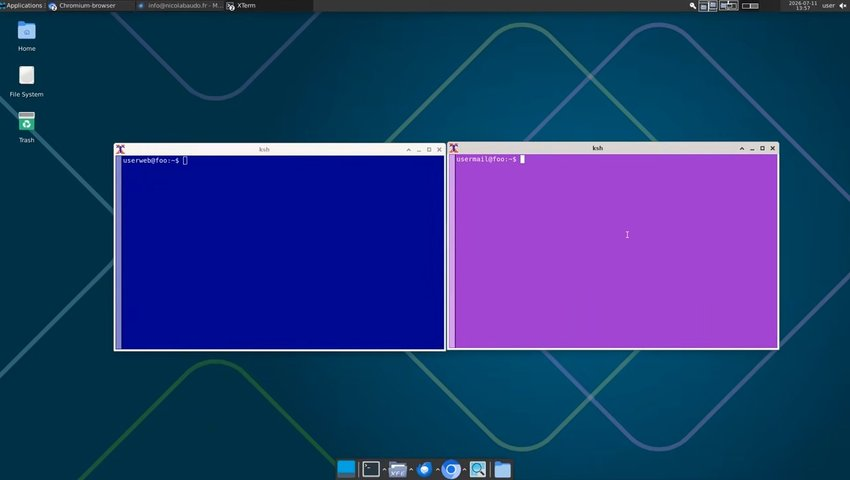

# dropQbsd

```
     __  +---+  __
       \_| Q |_/
         +---+
       dropQbsd
```

**Compartmentalization without virtualization -- on the BSD family.**

Qubes-style domain isolation using native Unix users, `pf`, and `ksh`. Web, mail,
and documents run as separate users with no shared access except a policed drop
zone. No hypervisor, no VM images, no daemon.

~2,800 lines of `ksh` (executable scripts in `sbin/`, `libexec/`, `admin/`,
comments and blank lines excluded) plus ~250 lines of shell templates, plus
35 lines of C -- small enough to audit in an afternoon.

Runs on 1 GB of RAM. Installs in ~30 minutes. Rebuilds faster -- no databases, no
daemon state to restore. Zero lock-in.

[](https://github.com/nobraininside/dropQbsd)
[](https://github.com/nobraininside/dropQbsd)
[](./LICENSE)
[](https://www.openbsd.org/)
[](https://www.freebsd.org/)
[](https://tangled.org/nobraininside.tngl.sh/dropQbsd)
[](https://github.com/nobraininside/dropQbsd)
[](https://git.sr.ht/~nobraininside/dropQbsd)

---

## Demo

[](https://gnulinux.tube/w/aymeWDMEZMbk2YQMqnMm93)

Three commands. Three habits. About thirty minutes. Done.

---

## What is this?

Take the core insight of Qubes OS -- security through compartmentalization -- and
strip away the hypervisor. **dropQbsd** uses native BSD user separation instead
of heavy virtualization.

Each domain -- web, mail, documents -- runs as a dedicated user. They share
nothing except a single policed exchange directory. A handful of `ksh` scripts,
a declarative firewall policy, and standard Unix permissions do the rest.

No multi-gigabyte VM images. No Xen. No moving parts you can't audit in an
afternoon.

---

## What dropQbsd does NOT protect against

Read this before the architecture. If your threat model requires any of the
following, dropQbsd is not the right tool today -- **Qubes OS is**.

- **X11 input isolation.** X11 shares a single cookie (MIT-MAGIC-COOKIE-1)
  across all clients on a display. A compromised domain can keylog other
  domains, capture screenshots, and read the clipboard. This is a fundamental
  X11 limitation, not a dropQbsd bug. Mitigations in place -- disposable
  sessions, per-session cookies, XTEST disabled where possible -- reduce the
  exposure window. They do not close it. **The paired desktop/server
  configuration (roadmap) resolves this.**
- **Conductor compromise.** `user` can launch apps in any domain via `run_app`.
  If `user` is compromised, all domains are compromised. Keep `user` minimal:
  no untrusted binaries, inspect files before importing.
- **Kernel-level attacks.** All domains share one kernel. A kernel exploit in
  one domain compromises everything. This is the tradeoff for avoiding
  virtualization.
- **Application-level telemetry.** BSD ships with zero telemetry, but
  applications you install may phone home independently. Use `librewolf`,
  `ungoogled-chromium`, or `qutebrowser`.

dropQbsd targets the most common real-world failures -- malware, phishing,
cross-domain data leaks, silent policy violations. It does not target kernel
exploits or state-level adversaries. Those require virtualization or hardware
isolation.

---

## Install

dropQbsd currently requires a manual installation on a fresh OpenBSD or FreeBSD
system. The process takes roughly 30 minutes and is documented step by step in
[INSTALL.md](./INSTALL.md).

An install script is on the roadmap -- it is the single biggest barrier to
adoption today, and the next development priority.

**Prerequisites:**

- A fresh OpenBSD (reference platform) or FreeBSD install
- 1 GB RAM minimum (2 GB recommended for daily use)
- `ksh` (OpenBSD base) or `mksh` (FreeBSD: `pkg install mksh`)
- Optional: `tmux`, `nnn`, `dzen2`, `xdotool`, `pass`, `zenity`, `xclip`

---

## Architecture

### The Four Domains

| User       | Role                                                   | Network                         |
| ---------- | ------------------------------------------------------ | ------------------------------- |
| `user`     | Conductor -- orchestrates, imports/exports, administers | None (no direct network access) |
| `userweb`  | Web browser -- isolated from mail and LAN               | HTTP/HTTPS only                 |
| `usermail` | Email client -- isolated from web                       | Mail servers only               |
| `userdoc`  | Documents, sync, LAN storage -- no direct internet      | LAN + Syncthing                 |

All belong to the `drop` group. Home directories are `chmod 700` -- no
cross-domain snooping.

### The Drop Zone (`/home/drop`)

The **only bridge** between domains. A shared directory with strict rules:

- `/home/drop` is `2770 root:drop` -- SGID forces the `drop` group on all files
- Files in transit: `440` (read-only for owner and group)
- Directories in transit: `570` (group can traverse)
- Export directories: SGID `2770`, owned by `root:drop`

No domain can modify files once placed. A cron job (`enforce_drop`) runs every
60 seconds, correcting permissions, quarantining violations, and cleaning
abandoned artifacts.

**Import workflow:**

1. `qmv` moves a file into `/home/drop` via an atomic staging directory.
2. `qcp` copies a file into `/home/drop` without deleting the original.
3. `qimport` copies the file out into `~/Downloads`.
4. `enforce_drop` removes abandoned files after 30 minutes.

### The Conductor -- `run_app` Architecture

`user` launches graphical apps inside any domain without switching users. The
mechanism is a three-file split designed to eliminate the attack surface of
privilege escalation:

| File                   | Type                          | Role                                                       |
| ---------------------- | ----------------------------- | ---------------------------------------------------------- |
| `bin/run_app`          | Compiled binary (setuid root) | Immutable gate -- 35 lines of C, no decision logic |
| `libexec/wrapper`      | `sh` script                   | Sanitizes the environment, selects the shell               |
| `libexec/run_app_impl` | `ksh`/`mksh` script           | All the logic -- domain selection, X11 cookie, tmpfs        |
| `src/run_app.c`| C source                      | Reference only; needed only if the ABI breaks              |

**The gate.** `run_app` validates the argument count, escalates to root with
`setuid(0)`, and `execv`s the wrapper at a hardcoded path. It does not parse
arguments, does not branch on input, and does not decide which script to run.
All session logic -- domain selection, X11 cookie handling, tmpfs setup -- 
lives in `run_app_impl`, a plain script. Immutable after compilation: if you
need to add a domain, change paths, or adjust cleanup behavior, you edit the
script. No recompilation.

**The wrapper is the environment-sanitization and shell-selection layer.** It runs with the privileges of its caller: root when invoked through `run_app` (which is setuid root), the domain user when invoked from a domain, root when invoked from cron. The wrapper sanitizes the environment before any script sees it:

- `PATH` is hardcoded to system directories. A user-controlled `PATH` in a root
  context is privilege escalation -- a fake `awk` earlier in `PATH` means
  arbitrary code as root.
- `IFS`, `LD_LIBRARY_PATH`, `LD_PRELOAD`, `PERL5LIB`, `PYTHONPATH`,
  `CDPATH`, `SHELL`, `HOME`, `LOGNAME`, `USER` are all unset.
- Only `DISPLAY`, `XAUTHORITY`, and `TERM` survive the crossing.
- The wrapper then selects the shell: `/bin/ksh` on OpenBSD, `mksh` on FreeBSD.

**`doas.conf` is one line:** `permit nopass root`. `user` has no `doas` access
at all. The only path to root is the blind gate, and the blind gate can only
launch domain applications.

**Two modes.** Normal mode creates an isolated runtime directory under `/tmp`,
cleaned on exit. Disposable mode mounts a tmpfs in RAM (500 MB default,
configurable) -- when the app exits, the tmpfs is unmounted and everything is
destroyed. Nothing survives. Ideal for browsers and untrusted files.

```
$ Run --disposable userweb qutebrowser --temp-basedir
$ Run --disposable 1G userweb ungoogled-chromium --temp-profile https://example.com
```

Downloads made in disposable mode are bridged to the real
`/home/$TARGET_USER/Downloads` via symlink -- files survive browser exit.

**Cleanup is guaranteed.** Traps on `EXIT`, `HUP`, `INT`, and `TERM` unmount
the tmpfs and remove the runtime directory. If the script is `SIGKILL`ed
(traps cannot catch it), `orphan_gc` collects surviving directories older than
24 hours at the next `run_app` invocation. Accumulation is structurally
impossible.

### Network Isolation

Network policy is **declarative and portable**. Two files describe your
security posture:

- `domains.conf` -- the portable policy. Identical on every installation.
  Describes intent, not syntax.
- `local.conf` -- your site configuration: subnet, mail servers, services.

`gen_fwall` translates this policy into `pf.conf` for the target OS.

The policy is default-deny with explicit allowlists:

| Domain     | Role       | Network access                                                        |
| ---------- | ---------- | --------------------------------------------------------------------- |
| `user`     | conductor  | None                                                                  |
| `userweb`  | browser    | Ports 80/443 to the internet, DNS. RFC 1918 and localhost blocked.    |
| `usermail` | mail       | Mail server ports only, DNS. Internet blocked.                        |
| `userdoc`  | documents  | LAN and Syncthing ports only, both directions. Internet blocked.      |

The policy file is short enough to read in full -- and that is the point. A
data protection officer with no networking background can verify what each
domain is permitted to reach.

**Portability note:** OpenBSD provides the `egress` interface group
automatically. FreeBSD does not -- `gen_fwall` resolves the physical interface
from `route get default`. This is the only portability gap between the two
`pf(4)` backends.

**NetBSD is not supported.** `npf(7)` filters by address and interface, not by
user. Per-user network isolation -- the foundation of dropQbsd's model -- cannot
be expressed in `npf`. `gen_fwall` refuses to generate a partial ruleset rather
than emit a firewall that silently drops per-user isolation.

### Domain Indicators

`indicator_de` shows an OSD popup when the active domain changes. Detection is a
cascade:

1. Window title -- exact match for `userweb`/`usermail`/`userdoc`/`user`/`root`
2. Window title containing `[root@` -- the shell prompt betrays root
3. `_NET_WM_PID` -- process owner via `ps`
4. `WM_CLASS` -- fallback for `xfe`/`Thunar`

Color mapping is consistent across the project:

| Domain             | Color         | Hex       |
| ------------------ | ------------- | --------- |
| `userweb`          | Bright blue   | `#3399FF` |
| `usermail`         | Bright orchid | `#BB66EE` |
| `userdoc`          | Bright green  | `#33CC33` |
| `user` (conductor) | White         | `#FFFFFF` |
| `root`             | Bright red    | `#FF3333` |

For tiling window managers (`i3`, `dwm`, `spectrwm`), the OSD indicator is not used. The base window managers of the supported platforms -- `cwm` on OpenBSD, `twm` on FreeBSD -- are also not suited to it: in these environments, domain differentiation is provided by the color schemes of terminals, `mc`, and `xfe` launchers (`examples/apps/mc/skins`, `xterm_*`).

Requires `dzen2`, `xdotool` and `xprop` (base X11).

---

## Daily Usage

### Aliases

All commands are invoked through aliases defined in `/etc/dropQbsd/alias`,
loaded by the shell chain. The naming rule: **every alias starts with a capital letter.** A single word when unambiguous; otherwise, the first letters of the significant words, capitalized and joined.

| Alias           | Command                            |
| --------------- | ---------------------------------- |
| `Gen`           | `admin/gen_fwall`                  |
| `Patch`         | `admin/patch_tru_fwall`            |
| `Pkg`           | `admin/pkg_tru_fwall`              |
| `Sign`          | `admin/sign_filelist`              |
| `Update`        | `admin/update_tru_fwall`           |
| `Upgrade`       | `admin/upgrade_tru_fwall`          |
| `Run`           | `bin/run_app`                      |
| `Endrop`        | `libexec/enforce_drop`             |
| `Ensync`        | `libexec/enforce_sync`             |
| `Enupdates`     | `libexec/ensure_updates_table`     |
| `Exmail`        | `libexec/export_mail_to_drop`      |
| `Exwww`         | `libexec/export_www_to_drop`       |
| `Immail`        | `libexec/import_mail_from_drop`    |
| `Imwww`         | `libexec/import_www_from_drop`     |
| `Upmailserver`  | `libexec/update_mailserver_table`  |
| `Upservices`    | `libexec/update_services_table`    |
| `Verify`        | `libexec/verify_integrity`         |
| `Control`       | `sbin/control_panel`               |
| `File`          | `sbin/file_bridge`                 |
| `Indicator`     | `sbin/indicator_de`                |
| `Qcp`           | `sbin/qcp`                         |
| `Qimport`       | `sbin/qimport`                     |
| `Qmv`           | `sbin/qmv`                         |
| `Site`          | `sbin/site_menu`                   |
| `Xtroot`        | `sbin/xterm_root`                  |
| `Xtuser`        | `sbin/xterm_user`                  |
| `Xtuserdoc`     | `sbin/xterm_userdoc`               |
| `Xtusermail`    | `sbin/xterm_usermail`              |
| `Xtuserweb`     | `sbin/xterm_userweb`               |
| ...             | see `/etc/dropQbsd/alias`          |

### Moving Files Between Domains

Files move through `/home/drop`, the only bridge between domains.

**Copy a file into the drop zone (original stays in place):**

```
$ Qcp ~/document.pdf
```

**Move a file into the drop zone (original is deleted):**

```
$ Qmv ~/document.pdf
```

`qcp` and `qmv` apply correct permissions immediately, reset file timestamps to
prevent premature cleanup, verify the copy succeeded, and stage files
atomically.

**Import from the drop zone into ~/Downloads:**

```
$ Qimport document.pdf
$ Qimport folder1
$ Qimport document.pdf ~/Documents
```

**Interactive transfer via file_bridge:**

```
$ File
```

Four quadrants: `control_panel` top-left, and `nnn` instances for `userdoc`
(green), `usermail` (orchid), `userweb` (blue). Press `Space` to select files,
then `;c` to copy, `;m` to move, or `;i` to import.

**Keys:**

| Key   | Action                                            |
| ----- | ------------------------------------------------- |
| `F1`  | Jump to control_panel                             |
| `F2`  | Jump to userdoc                                   |
| `F3`  | Jump to usermail                                  |
| `F4`  | Jump to userweb                                   |
| `F5`  | Kill the session                                  |
| Space | Select file(s) in nnn                             |
| `;c`  | Copy selected files to /home/drop via qcp         |
| `;m`  | Move selected files to /home/drop via qmv         |
| `;i`  | Import selected files from /home/drop via qimport |


**Note on F1-F5:** these bindings are global to the tmux server
(root key table), not scoped to the file_bridge session. While
file_bridge is running, F1-F5 are captured in every tmux session
on the machine. This is deliberate -- file_bridge is meant to be
the only tmux session in use. If you run other tmux sessions,
their F1-F5 will be overridden until file_bridge exits.

The status bar and active pane border follow the active domain. On exit,
`file_bridge` terminates orphaned `nnn` processes gracefully (SIGTERM, then
SIGKILL for survivors).

### Launching Apps in Domains

```
$ Run --disposable userweb qutebrowser --temp-basedir
$ Run usermail claws-mail
$ Run userdoc xfe /home/userdoc
```

Browser flags for temporary profiles:

- Chromium / Ungoogled-chromium: `--temp-profile`
- Firefox: `--private-window`
- Librewolf: `--temp-profile --private-window`
- Qutebrowser: `--temp-basedir`

### Control Panel

```
$ Control
```

An ncurses dashboard showing compartment status, drop zone contents, and system
health.

**What you see:**

- **Domains** -- which compartments are active and what process is running in each
- **Drop zone** -- files awaiting import (newer than 60 minutes), permissions, quarantine status
- **System** -- PF firewall state, enforcement logs, integrity verification, tmpfs usage (requires root authentication)

**Keys:**

| Key | Action                                                              |
| --- | ------------------------------------------------------------------- |
| `q` | Quit                                                                |
| `a` | Authenticate as root (shows PF state, logs, integrity)              |
| `r` | Refresh root snapshot (re-authenticates)                            |

**Privilege model:** root data is time-boxed. The snapshot expires after 5
minutes, and every refresh re-authenticates. The snapshot is written by
`root_snapshot` (running as root) into `/var/run/dropQbsd/` with `root:drop
0640`; the owner is verified before the panel trusts it, and the lines are
sanitized (ESC stripped) before printing.

### Site Menu

`site_menu` is a two-phase launcher for password-protected sites. It
reads a list of sites from `~/.config/dropQbsd/sites.conf`, copies
credentials to the X11 clipboard via `pass(1)`, and opens the site in
a disposable browser session.

**Two-phase flow** (the point is to never paste a password into the
wrong site):

1. Select a site > **Copy ID** > the browser opens, the user ID is
   copied to the clipboard, and the window stays open.
2. The same site is now the only entry shown > **Copy Password** > 
   the password is copied (with a 30-second clipboard clear timer),
   and the window closes.

Because phase 2 shows only the site that is waiting for the password,
there is no way to paste it into a different site.

**Configuration** -- `~/.config/dropQbsd/sites.conf`, one site per line:

```
# Label|URL|id_entry|pass_entry
Bank |https://bank.example.com|finance/bank_id|finance/bank_pw
ERP |https://erp.example.com|work/erp_id|work/erp_pw
# Sites without a separate ID field:
Forum|https://forum.example.com||web/forum
```

The `id_entry` and `pass_entry` are `pass(1)` paths. Store them with:

```
$ pass insert finance/bank_id
$ pass insert finance/bank_pw
```

**Launch:**

```
$ Site
```

**Requirements:** `zenity`, `pass`, `xclip`, and a browser. See
INSTALL.md for the setup.

### System Updates

System updates run through the scripts in `admin/`, using the
restrictive firewall. Root has no permanent network access: the
`<updates>` PF table is populated on demand by each script.

| Alias     | Purpose                                                    |
| --------- | ---------------------------------------------------------- |
| `Update`  | Full update: patches + firmware + packages + orphan cleanup |
| `Patch`   | Security patches only                                      |
| `Pkg`     | Install or update packages (`Pkg <name>` / `Pkg -u`)       |
| `Upgrade` | Major release upgrade (takes a `RELEASE` argument)         |

Each script refuses to start if another instance of the same tool is
already running, so two `pkg` processes cannot fight for the package
database lock.

**Release upgrades are multi-step on FreeBSD.** `Upgrade RELEASE`
automates the *sequence*, not the *moment*:

- **OpenBSD**: `sysupgrade` downloads the release set and reboots
  automatically.
- **FreeBSD (traditional base)**: `freebsd-update upgrade -r RELEASE`
  is phase 1 of 3. After rebooting, run `freebsd-update install`
  (repeat until it reports no more work), then `pkg upgrade -y`.
- **FreeBSD (PkgBase)**: `pkg upgrade -y -r RELEASE` prepares the
  upgrade. After rebooting, run `pkg upgrade -y` to sync the
  remaining packages.

When the upgrade is prepared but not finished, `Upgrade` leaves a
**pending-reboot marker** at `/var/log/dropQbsd/upgrade_pending`. The
login notice (from `/etc/dropQbsd/profile`) reads the marker and
reminds you that the upgrade is incomplete:

```
>>> dropQbsd: release upgrade PENDING -- the reboot has not
>>> been completed with the post-reboot install steps.
```

Remove the marker only after the post-reboot steps are done:

```sh
rm -f /var/log/dropQbsd/upgrade_pending
```

### Monitoring

**Logs** (one per script, named after the script):

```
$ tail /var/log/dropQbsd/enforce_drop.log
$ tail /var/log/dropQbsd/enforce_sync.log
$ tail /var/log/dropQbsd/verify_integrity.log
$ tail /var/log/dropQbsd/update_tru_fwall.log
```

**Check quarantine:**

```
$ ls -la /home/drop/_quarantine/
$ cat /home/drop/_quarantine/*.txt
```

**Live PF traffic:**

```
# tcpdump -n -e -ttt -i pflog0
```

**Integrity verification:**

```
$ Verify
```

---

## Scripts Reference

### Core Workflow

| Script              | Run by                | Purpose                                                        |
| ------------------- | --------------------- | -------------------------------------------------------------- |
| `file_bridge`       | user (conductor only) | 4-quadrant tmux bridge across all domains                      |
| `qimport`           | Any user              | Copy from drop zone to `~/Downloads`                           |
| `qmv`               | Any user              | Move file/directory into `/home/drop` via atomic staging       |
| `qcp`               | Any user              | Copy file/directory into `/home/drop` without deleting         |
| `run_app`           | user (setuid root)    | Blind-gate binary. Escalates to root, execs `wrapper`          |
| `wrapper`           | root (via run_app)    | Sanitizes environment, selects the shell, execs the script     |
| `run_app_impl`      | root (via wrapper)    | Launch logic -- X11 cookie, runtime dir, tmpfs, `su -l`         |

### Launchers and Utilities

| Script           | Run by                | Purpose                                                              |
| ---------------- | --------------------- | -------------------------------------------------------------------- |
| `control_panel`  | user (conductor only) | ncurses dashboard -- domain status, drop zone, system health          |
| `indicator_de`   | user (conductor only) | Domain indicator for XFCE/MATE via OSD popup                         |
| `site_menu`      | user (conductor only) | Two-phase site launcher with `pass(1)` integration                   |
| `xterm_root`     | user (conductor only  | Color-coded xterm, then `su -` to root                               |
| `xterm_user`     | user (conductor only) | Color-coded xterm for the conductor domain (black)                   |
| `xterm_userdoc`  | user (conductor only) | Color-coded xterm for userdoc domain (dark green)                    |
| `xterm_usermail` | user (conductor only) | Color-coded xterm for usermail domain (dark orchid)                  |
| `xterm_userweb`  | user (conductor only) | Color-coded xterm for userweb domain (dark blue)                     |

### Export/Import Pipeline

Run automatically by root's crontab on a schedule. Can also be run manually.

| Script                 | Domain   | Purpose                                                |
| ---------------------- | -------- | ------------------------------------------------------ |
| `export_www_to_drop`   | userweb  | Compress `~/www` into `userweb_export`, verify integrity |
| `export_mail_to_drop`  | usermail | Compress mail into `usermail_export`                   |
| `import_www_from_drop` | userdoc  | Import latest site archive, verify, keep 3 backups     |
| `import_mail_from_drop`| userdoc  | Import latest mail archive, keep 1 backup              |

Archives are published atomically: exporters write a `*.tar.gz.tmp` file and
rename it when complete. Importers only match `*.tar.gz`, so a partial archive
is never imported. If an export runs long, that slot's import exits 0 and the
next run imports the complete archive.

### Enforcement (cron, every minute)

| Script          | Run by | Purpose                                                                                             |
| --------------- | ------ | --------------------------------------------------------------------------------------------------- |
| `enforce_drop`  | root   | Fix permissions, quarantine violations, clean abandoned files. Logs to `/var/log/dropQbsd/enforce_drop.log`. |
| `enforce_sync`  | root   | Fix owner/group/permissions in Sync directory. Logs to `/var/log/dropQbsd/enforce_sync.log`.        |

### Firewall Table Management (cron)

| Script                    | Run by | Purpose                                                                                      |
| ------------------------- | ------ | -------------------------------------------------------------------------------------------- |
| `update_mailserver_table` | root   | Resolve mail server hostnames via userweb DNS, populate `<mailserver>` table from local.conf |
| `update_services_table`   | root   | Populate `<services>` table from local.conf                                                  |
| `ensure_updates_table`    | root   | Populate `<updates>` table with Fastly CDN blocks from local.conf                            |

### System Updates (root only)

| Script                | Run by | Purpose                                                                       |
| --------------------- | ------ | ----------------------------------------------------------------------------- |
| `patch_tru_fwall`     | root   | Apply security patches through restrictive PF                                |
| `pkg_tru_fwall`       | root   | Install/update packages through restrictive PF; flushes `<updates>` on exit  |
| `upgrade_tru_fwall`   | root   | Upgrade to next BSD release through restrictive PF (reboots)                 |
| `update_tru_fwall`    | root   | Full update: patch + firmware + pkg update + orphan cleanup                  |

### Integrity

| Script             | Run by      | Purpose                                                                                                          |
| ------------------ | ----------- | ---------------------------------------------------------------------------------------------------------------- |
| `sign_filelist`    | root (manual) | Sign the SHA256 manifest against the private key. Used after any change to a monitored file. |
| `verify_integrity` | root (cron)   | Verify monitored files against the signed manifest via `signify(1)`. Logs to `/var/log/dropQbsd/verify_integrity.log`. |

The integrity keys are generated locally during setup, not distributed with the
repository. Each installation verifies its own scripts against its own
signature.

### Recovery

The entire system state is in a few places:

- **Scripts** in `/opt/dropQbsd/`
- **Users and groups** in `/etc/passwd`, `/etc/group`
- **Policy** in `/etc/dropQbsd/` (`domains.conf`, `local.conf`, `schema`)
- **PF rules** generated in `/etc/pf.conf`
- **Cron jobs** in `/var/cron/tabs/root`

**To rebuild from scratch:**

1. Install OpenBSD (or FreeBSD)
2. Copy the scripts to `/opt/dropQbsd/`
3. Run the user/group creation commands
4. Compile the `run_app` blind gate and set the setuid bit
5. Copy `domains.conf`, `schema`, and `local.conf` to `/etc/dropQbsd/`
6. Run `Gen openbsd` (or `Gen freebsd`) and reload
7. Populate `local.conf` with your provider IPs
8. Add cron jobs

Typically under 30 minutes, often less. No databases to restore. No daemon state
to reconstruct.

---

## Portability

dropQbsd runs on OpenBSD and FreeBSD from a **single codebase**. No forks, no
per-OS patches, no duplicated scripts.

The mechanism is a runtime shell selector. `libexec/wrapper` detects the
operating system and executes the target script with the appropriate Korn Shell
variant:

| OS        | Shell                   | Notes                            |
| --------- | ----------------------- | -------------------------------- |
| OpenBSD   | `/bin/ksh`              | Base system (PD KSH)             |
| FreeBSD   | `/usr/local/bin/mksh`   | `mksh` must be installed         |
| NetBSD    | --                      | Not supported -- see below       |

Scripts in `sbin/` and `libexec/` carry **no shebang**. The wrapper decides.
Adding a new OS means extending one `case` statement -- not editing every script.

**Firewall backends** follow the same principle. `gen_fwall` reads a portable
policy (`domains.conf`) and a site configuration (`local.conf`), then emits
`pf.conf` for the target system.

The only portability gap between the OpenBSD and FreeBSD `pf(4)` backends is
interface detection: OpenBSD provides the `egress` interface group
automatically, while FreeBSD resolves the physical interface from
`route get default`.

**NetBSD is not supported.** `npf(7)` filters by address and interface, not by
user. Per-user network isolation cannot be expressed in `npf`. `gen_fwall`
refuses to generate a partial ruleset rather than emit a firewall that silently
drops per-user isolation.

---

## Philosophy

**dropQbsd** is not a distribution. It's a configuration. It doesn't fork the
BSDs -- it sits on top, using tools battle-tested for decades.

The goal is not to add layers of abstraction but to remove them. If Unix users
and permissions already provide isolation, why add a hypervisor? If `cron` and
`find` can police a shared directory, why run a daemon? If `ksh` and `pfctl`
can manage network access for updates, why build a package manager wrapper? If a 35-line setuid C binary can gate privilege escalation, why give `user` a
`doas` ticket to the whole system?


**Complexity is the enemy of security.** dropQbsd keeps it simple, auditable,
and boring -- exactly what you want from a security tool.

---

## Roadmap

**Done:**

- ✅ Desktop standalone -- four domains, PF isolation, drop zone
- ✅ Disposable browser sessions (tmpfs-backed)
- ✅ Site menu with password manager integration
- ✅ Archival pipeline (email + websites > userdoc)
- ✅ Declarative firewall policy (`gen_fwall`, `domains.conf` + `local.conf`)
- ✅ FreeBSD support (v0.3.0) -- same codebase, shebang selected by wrapper

**In progress:**

- 🚧 Install script (`install.sh`) -- the current manual install is the main
  barrier to adoption

**Planned:**

- 📋 Ports tree submission (OpenBSD first, then FreeBSD)
- 📋 dropQbsd-paired + server (WireGuard client-server, input isolation)
- 📋 NetBSD support (requires redesigning isolation for `npf`; lower priority)

**Note on NetBSD:** `npf` does not filter by user, so the network isolation
model used on OpenBSD and FreeBSD does not translate directly. NetBSD support
requires a redesign of the per-domain network policy, not a port.

---

## Design rationale

dropQbsd is the engineering expression of a longer argument about software,
verification, and accountability. Three articles lay out the reasoning:

- **[If you have an antivirus, you're probably in breach of GDPR](https://blog.nicolabaudo.fr/if-you-have-an-antivirus-you-re-probably-in-breach-of-gdpr/)** -- 
  Why endpoint security products are architecturally incompatible with GDPR
  accountability: root access, undocumented exfiltration, unverifiable claims.

- **[You cannot verify what you cannot see](https://blog.nicolabaudo.fr/you-cannot-verify-what-you-cannot-see-closed-source-privacy/)** -- 
  Why "privacy-respecting closed-source software" is a logical contradiction,
  and why audit theater cannot substitute for source access.

- **[Who are the real predators in cybersecurity?](https://blog.nicolabaudo.fr/who-are-the-real-predators-in-cybersecurity/)** -- 
  Risk as probability × severity, and why the dominant threat is not the
  hacker in the hoodie.

The full series -- *Embrace Philosophy or Let the Sophist Zombify* -- is at
[blog.nicolabaudo.fr/embrace-philosophy](https://blog.nicolabaudo.fr/embrace-philosophy/).

---

## GDPR and Privacy Professionals

If your organization processes personal data under GDPR, the architectural
argument for dropQbsd is developed in full in [GDPR.md](./GDPR.md): why
privacy by design (Art. 25) and staff training (Art. 39) are properties of
the system, not of the policy document.

---

## License

ISC. See [LICENSE](./LICENSE).

